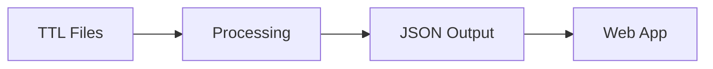

# Content System

> Markdown-based content pages using Nuxt Content.

## Overview

prez-lite uses [Nuxt Content](https://content.nuxt.com/) for static content pages, enabling:
- Markdown authoring with frontmatter
- Automatic navigation generation
- MDC components for rich content
- Mermaid diagram support

---

## Content Pages

### Current Pages

| File | Route | Navigation | Purpose |
|------|-------|------------|---------|
| `index.md` | `/` | ✅ Order: 1 | Home page |
| `vocabs.md` | `/vocabs` | ✅ Order: 2 | Vocabulary listing intro |
| `search.md` | `/search` | ✅ Order: 3 | Search page intro |
| `about.md` | `/about` | ✅ Order: 4 | About the site |
| `share.md` | `/share` | ✅ | Share feature intro |
| `profile-helper.md` | `/profile-helper` | ✅ | Profile helper intro |
| `authoring.md` | `/authoring` | ✅ | Authoring docs |

### Frontmatter

```yaml
---
title: Page Title
description: Meta description for SEO
navigation: true              # Include in nav menu
order: 1                      # Navigation order (lower = earlier)
navTitle: Short Title         # Optional shorter nav label
---
```

---

## Creating Content

### Basic Page

Create a markdown file in `web/content/`:

```markdown
---
title: My New Page
navigation: true
order: 5
---

# My New Page

Page content goes here.

## Subheading

More content...
```

The page will be available at `/{filename}` (without .md).

### Content Features

| Feature | Syntax | Example |
|---------|--------|---------|
| **Headings** | `# ## ###` | `## Section` |
| **Links** | `[text](url)` | `[About](/about)` |
| **Images** | `` | `` |
| **Code** | `` `code` `` | `` `prefLabel` `` |
| **Code Blocks** | ` ```lang ``` ` | See below |

### Code Blocks

````markdown
```typescript
const example = 'code'
```
````

---

## MDC Components

Nuxt Content supports [MDC](https://content.nuxt.com/usage/markdown#mdc-syntax) (Markdown Components).

### Callouts

```markdown
::callout{type="info"}
This is an info callout.
::

::callout{type="warning"}
This is a warning.
::
```

### Tabs

```markdown
::tabs
  ::tab{label="JavaScript"}
  ```js
  console.log('Hello')
  ```
  ::
  ::tab{label="Python"}
  ```python
  print('Hello')
  ```
  ::
::
```

### Cards

```markdown
::card{title="Feature Name"}
Feature description goes here.
::
```

---

## Mermaid Diagrams

Create flowcharts, sequence diagrams, and more:

````markdown

````

Renders as:


---

## Navigation

### Automatic Generation

Pages with `navigation: true` in frontmatter are automatically added to the site navigation.

### Ordering

Use the `order` field to control position:
- Lower numbers appear first
- Pages without order appear last

### Custom Labels

Use `navTitle` for shorter navigation labels:

```yaml
---
title: Comprehensive Profile Builder Guide
navTitle: Profile Helper
navigation: true
---
```

---

## Catch-All Route

The `[...slug].vue` page handles all content routes:

```
web/app/pages/[...slug].vue
```

This renders markdown content from the corresponding `web/content/*.md` file.

---

## Implementation

### Key Files

| File | Purpose |
|------|---------|
| `web/content/*.md` | Content source files |
| `web/app/pages/[...slug].vue` | Content page renderer |
| `web/nuxt.config.ts` | Nuxt Content module config |

### Configuration

In `nuxt.config.ts`:

```typescript
export default defineNuxtConfig({
  modules: ['@nuxt/content'],
  content: {
    // Content configuration
  }
})
```
