# CI/CD Workflows

Overview of all GitHub Actions workflows and composite actions in this repository.

## Workflow Map

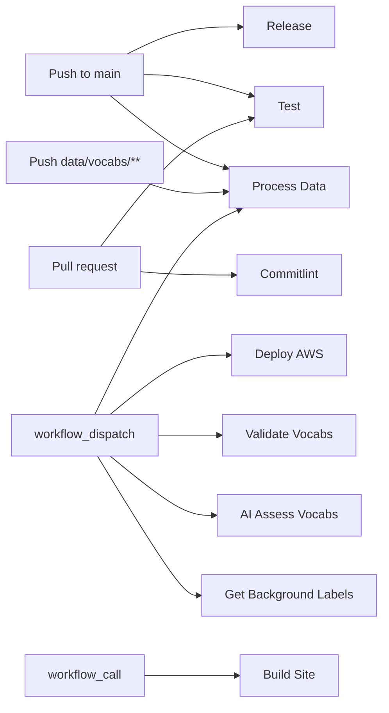

---

## Workflows

### Test

> Runs unit, component, integration, and E2E tests in parallel.

| | |
|---|---|
| **File** | `.github/workflows/test.yml` |
| **Trigger** | Auto: push to `main`, pull request to `main` |

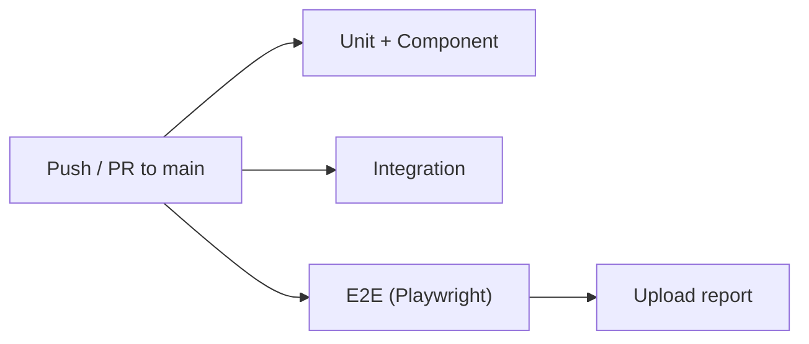

**Jobs** (all run concurrently):
- **unit-and-component** — `pnpm --filter @prez-lite/web test:unit`
- **integration** — `pnpm --filter @prez-lite/web test:integration`
- **e2e** — Installs Playwright Chromium, runs `test:e2e`, uploads report artifact (30 day retention)

---

### Commitlint

> Validates PR titles follow conventional commit format.

| | |
|---|---|
| **File** | `.github/workflows/commitlint.yml` |
| **Trigger** | Auto: PR opened, edited, synchronize, reopened |

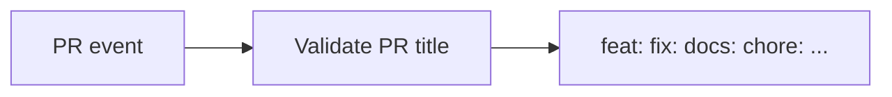

Uses `amannn/action-semantic-pull-request@v5`. Scope not required.

---

### Process Data

> Processes vocabulary TTL files into JSON exports. Supports incremental builds.

| | |
|---|---|
| **File** | `.github/workflows/process-data.yml` |
| **Trigger** | Auto: push to `main` when `data/vocabs/**` changes. Manual: full rebuild. |

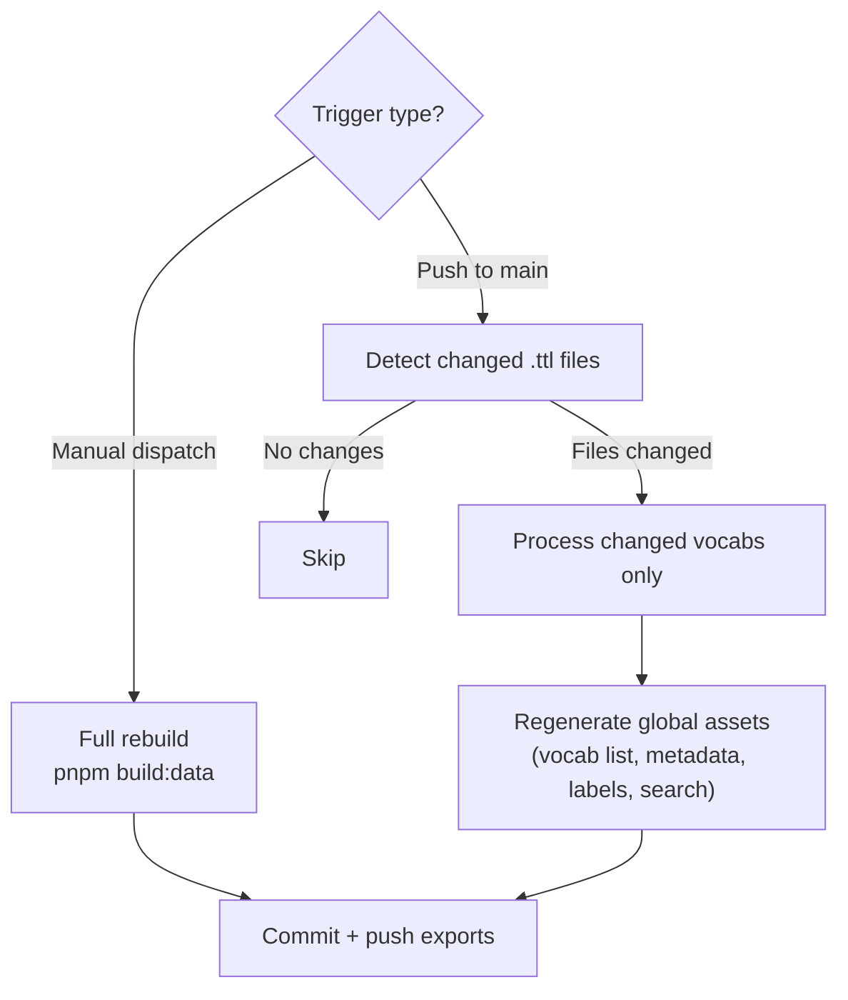

Checks out with `fetch-depth: 2` for diff detection. Writes to `web/public/export/`.

---

### Release

> Creates releases via Release Please (conventional commits).

| | |
|---|---|
| **File** | `.github/workflows/release.yml` |
| **Trigger** | Auto: push to `main` |

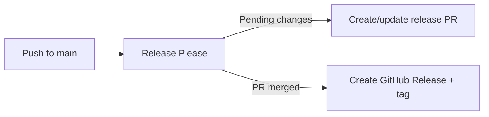

Uses `googleapis/release-please-action@v4`.

---

### Deploy AWS

> Deploys the site or data to S3 + CloudFront.

| | |
|---|---|
| **File** | `.github/workflows/deploy-aws.yml` |
| **Trigger** | Manual: `workflow_dispatch` with `deploy-mode` input |

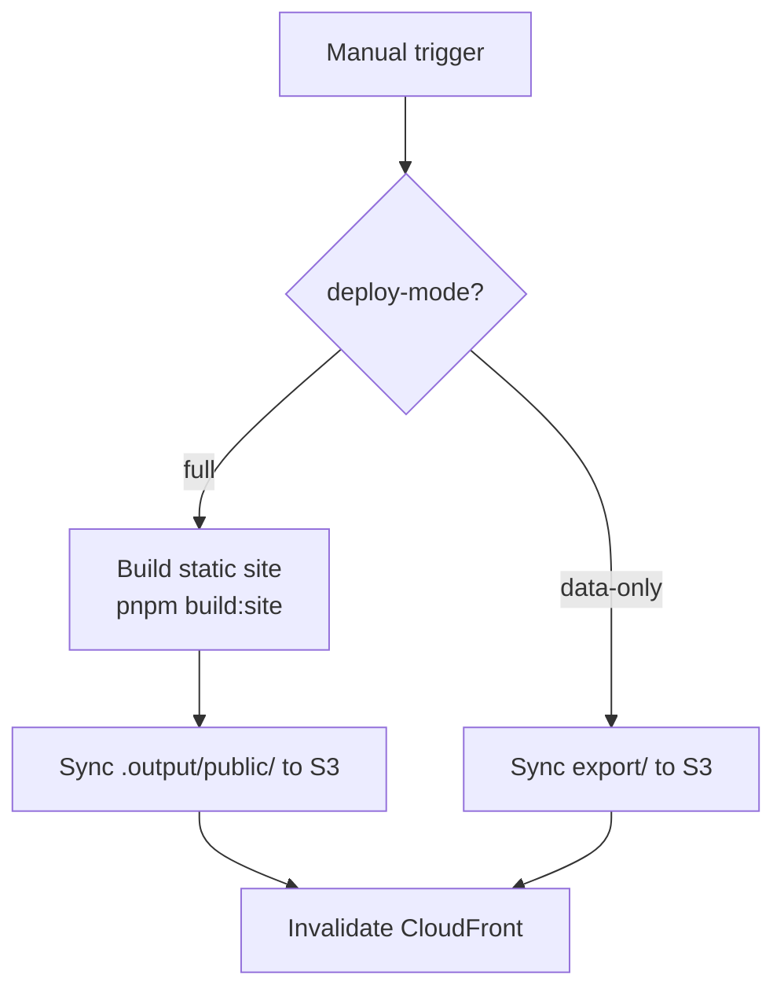

Uses OIDC role assumption for AWS credentials. Requires `AWS_ROLE_ARN` secret and `DEV_BUCKET_NAME` var.

---

### Build Site (Reusable)

> Called by downstream gh-template repos to build and deploy to GitHub Pages.

| | |
|---|---|
| **File** | `.github/workflows/build-site.yml` |
| **Trigger** | `workflow_call` (reusable workflow) |
| **Inputs** | `prez-lite-version` (default: `main`), `node-version` (default: `22`) |

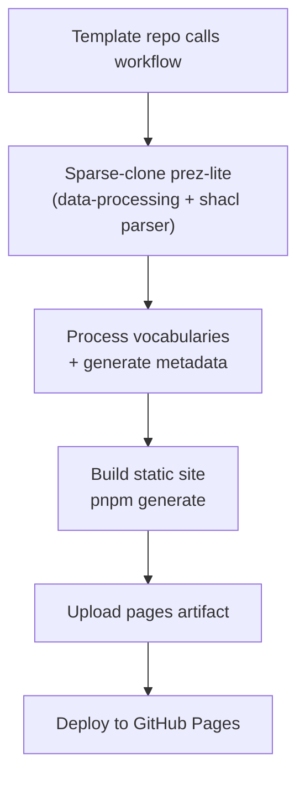

Template repos don't bundle the pipeline — this workflow fetches it at build time.

---

### Validate Vocabularies

> Runs SHACL validation on all vocabularies and commits reports.

| | |
|---|---|
| **File** | `.github/workflows/validate-vocabs.yml` |
| **Trigger** | Manual: `workflow_dispatch` |

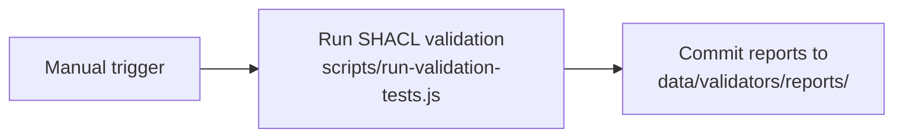

---

### AI Assess Vocabularies

> Runs SHACL validation then sends results to an AI worker for remediation reports.

| | |
|---|---|
| **File** | `.github/workflows/ai-assess-vocabs.yml` |
| **Trigger** | Manual: `workflow_dispatch` |

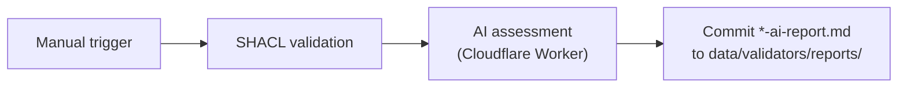

Requires `AI_WORKER_URL` var and `AI_WORKER_KEY` secret.

---

### Get Background Labels

> Fetches labels from a SPARQL endpoint for use as background context.

| | |
|---|---|
| **File** | `.github/workflows/get-background-labels.yml` |
| **Trigger** | Manual: `workflow_dispatch` with optional `endpoint` input |

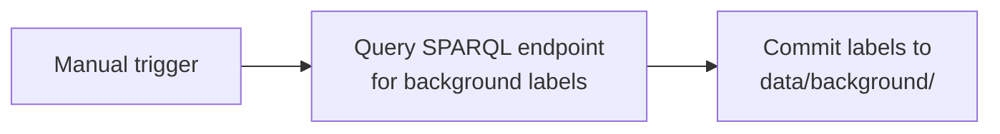

Default endpoint: `http://demo.dev.kurrawong.ai/sparql`. Requires Python 3.12.

---

## Composite Actions

### Process Vocabularies Action

| | |
|---|---|
| **File** | `.github/actions/process-vocabs/action.yml` |
| **Type** | Composite action |

Encapsulates vocabulary processing for reuse. Accepts `source-dir` or `source-file`, `profiles`, `output-dir`, `background-dir`, and `type`. Outputs `files-processed` count.

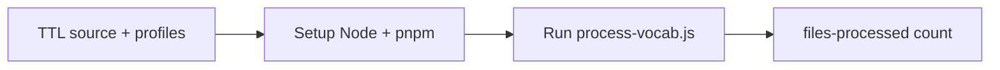

### Deploy Template (for gh-template repos)

| | |
|---|---|
| **File** | `.github/actions/process-vocabs/deploy.yml` |
| **Type** | Workflow template (not reusable — copied into template repos) |
| **Trigger** | Push to `main`/`master`, `workflow_dispatch` |

Self-contained GitHub Pages deploy for repos that have the pipeline locally (this repo or forks). Simpler alternative to the reusable `build-site.yml`.

---

## Trigger Summary

| Workflow | Push | PR | Manual | Called |
|----------|:----:|:--:|:------:|:------:|
| Test | main | main | | |
| Commitlint | | all | | |
| Process Data | `data/vocabs/**` | | yes | |
| Release | main | | | |
| Deploy AWS | | | yes | |
| Build Site | | | | yes |
| Validate Vocabs | | | yes | |
| AI Assess Vocabs | | | yes | |
| Get Background Labels | | | yes | |

## Secrets and Variables

| Name | Type | Used by |
|------|------|---------|
| `AWS_ROLE_ARN` | Secret | Deploy AWS |
| `AI_WORKER_KEY` | Secret | AI Assess |
| `AI_WORKER_URL` | Var | AI Assess |
| `DEV_BUCKET_NAME` | Var | Deploy AWS |
| `DEV_CDN_ID` | Var | Deploy AWS |
| `GH_REPO_SLUG` | Var | Deploy AWS |
| `GH_BRANCH` | Var | Deploy AWS |
| `GH_VOCAB_PATH` | Var | Deploy AWS |
| `GH_CLIENT_ID` | Var | Deploy AWS |
| `GH_AUTH_WORKER_URL` | Var | Deploy AWS |
