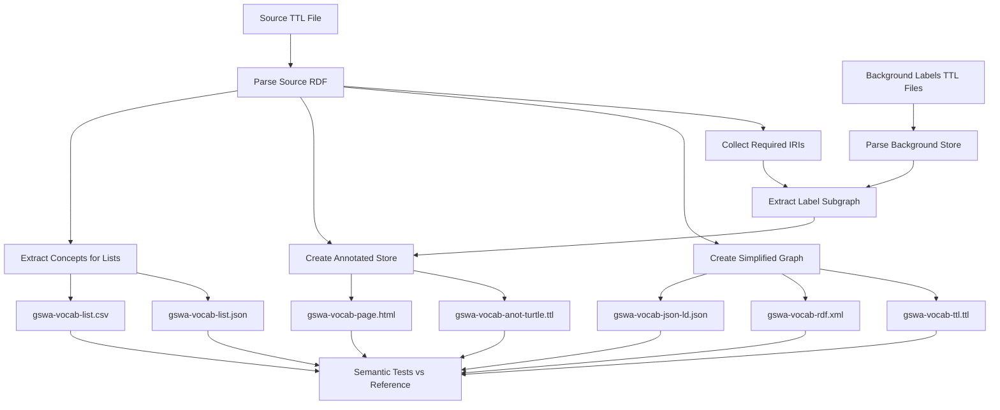

# prez-lite Scripts

This directory contains scripts for vocabulary data processing in prez-lite.

## Overview

The vocabulary processing pipeline transforms SKOS vocabulary source files (TTL) into multiple export formats suitable for web publishing and data exchange.

## Architecture



## Scripts

### `process-vocab.js`

Main vocabulary processing pipeline. Generates multiple export formats from a source TTL file.

**Usage:**
```bash
node scripts/process-vocab.js [options]
```

**Options:**
- `--source <path>` - Path to source TTL file (default: `packages/data-processing/examples/gswa-vocab-ref/gswa-vocab-source.ttl`)
- `--backgroundDir <path>` - Path to background labels directory (default: `data/background/`)
- `--outDir <path>` - Output directory (default: `packages/data-processing/examples/gswa-vocab-output/`)
- `--help` - Show help message

**Generated Outputs:**
| File | Description |
|------|-------------|
| `*-anot-turtle.ttl` | Annotated Turtle - ConceptScheme with resolved labels for predicates and objects |
| `*-ttl.ttl` | Simplified Turtle - Full ConceptScheme + concept structural relations only |
| `*-rdf.xml` | RDF/XML serialization of the simplified graph |
| `*-json-ld.json` | JSON-LD (expanded form) of the simplified graph |
| `*-list.json` | JSON list of concepts with IRI, broader, prefLabel |
| `*-list.csv` | CSV list of concepts |
| `*-page.html` | Bulma-styled HTML page for the vocabulary |

### `test-vocab-processing.js`

Test harness that compares generated outputs against reference files using semantic normalization.

**Usage:**
```bash
node scripts/test-vocab-processing.js [options]
```

**Options:**
- `--outDir <path>` - Directory with generated outputs
- `--refDir <path>` - Reference directory for comparison
- `--regenerate` - Regenerate outputs before testing
- `--verbose, -v` - Show detailed diff information
- `--help` - Show help message

**Comparison Strategies:**
- **Turtle/JSON-LD**: Parse to RDF quads and compare semantically (order-independent, blank node normalized)
- **RDF/XML**: Structural comparison (element counts and key patterns)
- **CSV/JSON**: Parse, normalize, and deep-equal comparison
- **HTML**: Smoke test for required elements (title, IRI, metadata, concepts table)

### `build-data.js`

Generates JSON data files for the prez-lite web application from vocabularies in `data/vocabs/`.

**Usage:**
```bash
node scripts/build-data.js
```

### `export-vocabs.js`

Generates multi-format exports for all vocabularies in `data/vocabs/`.

**Usage:**
```bash
node scripts/export-vocabs.js
```

### `fetch-labels.sh`

Fetches and caches background labels using prezmanifest.

**Usage:**
```bash
./scripts/fetch-labels.sh [--refresh]
```

### `clone-resources.sh`

Clones reference repositories into `resources/` for local development.

**Usage:**
```bash
./scripts/clone-resources.sh
```

### `skip-export-worktree.sh` / `unskip-export-worktree.sh`

Keep `web/public/export/` in the repo (so CI can update it) while ignoring your local changes. Uses `git update-index --skip-worktree` so local edits and build outputs under that folder are not committed.

**Usage:**
```bash
# After clone (or when you want to stop committing export changes)
./scripts/skip-export-worktree.sh

# When you need to pull CI updates or commit export changes
./scripts/unskip-export-worktree.sh
```

After running `unskip-export-worktree.sh`, pull or merge, then run `skip-export-worktree.sh` again if you want to keep local export changes ignored.

## Design Decisions

### Technology Stack

- **Node.js** - Matches existing prez-lite infrastructure
- **N3.js** - Industry-standard RDF parsing/serialization library
- **jsonld.js** - W3C JSON-LD processor
- **@fast-csv/format** - Fast, standards-compliant CSV generation

### Graph Types

1. **Annotated Store** - ConceptScheme view with:
   - ConceptScheme metadata (excluding `skos:hasTopConcept`, replaced with `prez:childrenCount`)
   - Labels for predicates (rdfs:label, schema:description)
   - Labels for object IRIs (status, publisher, creator, etc.)

2. **Simplified Store** - Full vocabulary structure with:
   - Complete ConceptScheme with all metadata
   - Concepts with `skos:broader`, `skos:narrower`, `skos:inScheme` only
   - Blank node structures for qualified attributions

### Background Labels

Background labels are sourced from:
1. `data/background/*.ttl` - Domain-specific label files (GSWA vocabularies, agents, etc.)
2. `data/background/standard-vocab-labels.ttl` - Standard RDF/SKOS/Schema predicate labels

Labels are extracted for:
- Predicate IRIs used in the source
- Object IRIs referenced by the source
- IRIs reachable through blank nodes (e.g., `prov:agent`, `prov:hadRole`)

### Semantic Comparison

Tests use semantic comparison rather than byte-for-byte equality because:
- RDF serialization order may vary
- Blank node IDs are implementation-specific
- Namespace prefixes may differ

Blank nodes are compared by their content signature rather than ID.

## Known Limitations

1. **Annotated Turtle Labels**: The annotated turtle output may differ from Prez-generated references in:
   - Language tag presence/formatting
   - Self-referential predicate labels (e.g., `rdfs:label rdfs:label "label"`)
   - External vocabulary labels not in the standard background

2. **RDF/XML Comparison**: Uses structural comparison rather than full semantic parsing due to N3.js limitations.

## Future: GitHub Action Packaging

The pipeline is designed to be packaged as a GitHub Action:

```yaml
# Example workflow usage (future)
- uses: owner/prez-lite-vocab-processor@v1
  with:
    source-dir: vocabs/
    background-dir: background/
    output-dir: output/
    fail-on-diff: true
```

**Recommended Action Type**: Bundled Node action
- Fastest execution
- Self-contained dependencies
- Clean versioning via tags/SHA

**Inputs:**
- `source-dir` - Directory containing source TTL files
- `background-dir` - Directory containing background label TTL files
- `output-dir` - Output directory for generated files
- `fail-on-diff` - Whether to fail if outputs don't match reference

**Outputs:**
- Per-vocabulary folders with all export formats
- Background labels folder
- Processing summary

## Directory Structure

```
prez-lite/
├── data/
│   ├── vocabs/              # Source vocabulary TTL files
│   └── background/          # Background label TTL files
├── packages/
│   └── data-processing/
│       └── examples/
│           ├── gswa-vocab-ref/     # Reference outputs for testing
│           └── gswa-vocab-output/  # Generated outputs
└── scripts/
    ├── README.md                  # This file
    ├── process-vocab.js           # Main processing pipeline
    ├── test-vocab-processing.js   # Test harness
    ├── build-data.js              # Web app data generator
    ├── export-vocabs.js           # Multi-format exporter
    ├── fetch-labels.sh            # Background label fetcher
    ├── clone-resources.sh         # Reference repo cloner
    ├── skip-export-worktree.sh    # Ignore local export/ changes
    └── unskip-export-worktree.sh  # Resume tracking export/
```

## Example Workflow

```bash
# 1. Ensure background labels are up to date
./scripts/fetch-labels.sh

# 2. Process a vocabulary
node scripts/process-vocab.js --source data/vocabs/my-vocab.ttl --outDir output/

# 3. Run tests
node scripts/test-vocab-processing.js --verbose

# 4. Build web app data
node scripts/build-data.js

# 5. Generate exports
node scripts/export-vocabs.js
```
