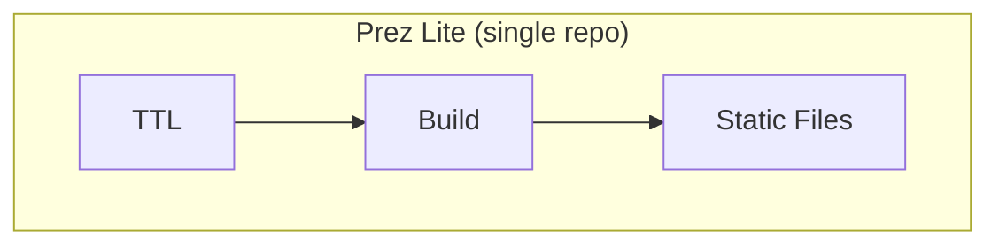
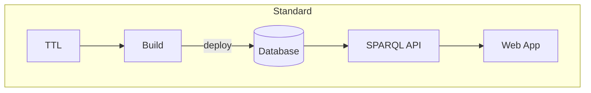
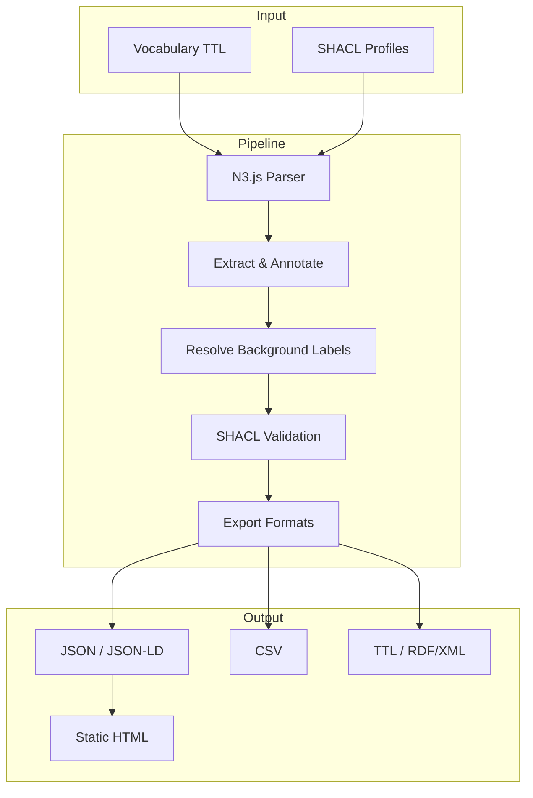

# About Prez Lite

Prez Lite is a lightweight alternative to the full [Prez](https://github.com/RDFLib/prez) system, designed for publishing SKOS vocabularies as static websites.

## The problem

Traditional vocabulary publishing requires running infrastructure — SPARQL endpoints, application servers, and databases. This creates barriers for teams that just want to share their controlled vocabularies.

## The approach

Prez Lite takes a different path: process everything at build time and deploy static files.

No servers to maintain, no databases to manage, no endpoints to monitor. One repository, one build, deployed as plain files to any static host.

## Architecture

## Technology

| Layer | Technology |
|-------|------------|
| Application | Nuxt 4 (Vue 3) |
| UI | Nuxt UI + Tailwind CSS |
| RDF Processing | N3.js |
| Validation | rdf-validate-shacl |
| Web Components | Lit |
| Hosting | GitHub Pages (or any static host) |
| CI/CD | GitHub Actions |

## Standards

Prez Lite supports vocabularies conforming to:

- **[SKOS](https://www.w3.org/2004/02/skos/)** — Simple Knowledge Organization System for concept schemes, hierarchies, and collections
- **[VocPub](https://w3id.org/profile/vocpub)** — Vocabulary Publication Profile for consistent metadata
- **[SHACL](https://www.w3.org/TR/shacl/)** — Shapes Constraint Language for validation and configuration
- **[DCAT](https://www.w3.org/TR/vocab-dcat/)** — Data Catalog vocabulary for dataset descriptions
- **[Dublin Core](https://www.dublincore.org/)** and **[Schema.org](https://schema.org/)** — Metadata standards

## Contributing

Prez Lite is open source. Contributions are welcome at the [GitHub repository](https://github.com/Kurrawong/prez-lite).

## License

BSD 3-Clause License.
