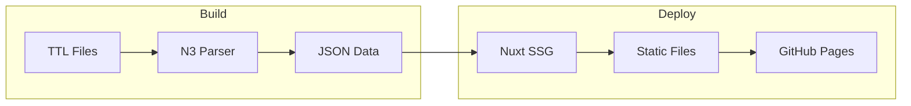

# About Prez Lite

Prez Lite is a lightweight alternative to the full [Prez](https://github.com/RDFLib/prez) system, designed for publishing SKOS vocabularies as static websites.

## Why Prez Lite?

Traditional vocabulary publishing systems require:

- A running SPARQL endpoint
- Server infrastructure
- Database management

Prez Lite eliminates these requirements by:

1. **Pre-processing** vocabularies at build time
2. **Generating** static JSON and HTML
3. **Deploying** to any static hosting service

## Architecture

## Technology Stack

| Component | Technology |
|-----------|------------|
| Framework | Nuxt 4 |
| UI Library | Nuxt UI |
| RDF Parsing | N3.js |
| Styling | Tailwind CSS |
| Hosting | GitHub Pages |

## Standards Support

Prez Lite supports vocabularies conforming to:

- **SKOS** - Simple Knowledge Organization System
- **VocPub** - Vocabulary Publication Profile
- **Dublin Core** - Metadata standards

## Contributing

Prez Lite is open source. Contributions are welcome at the [GitHub repository](https://github.com/Kurrawong/prez-lite).

## License

This project is licensed under the BSD 3-Clause License.
