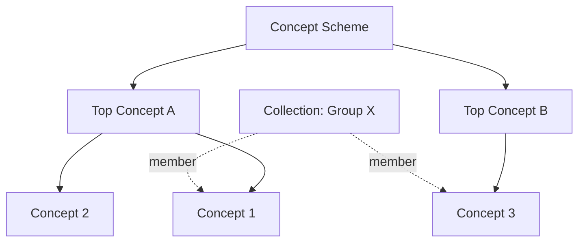

# SKOS Collections

Collections are named groupings of concepts within a vocabulary. Unlike the concept hierarchy (broader/narrower), collections provide a flat, cross-cutting way to organize concepts.

## What are Collections?

A `skos:Collection` groups related concepts together using `skos:member` links. Collections are useful when you need to categorize concepts in ways that don't fit the hierarchical tree.



A single concept can belong to multiple collections while maintaining its position in the broader/narrower hierarchy.

## Collections in Prez Lite

Vocabularies that include collections display them on the scheme page in a dedicated **Collections** card between the concept tree and metadata. Each collection shows:

- **Label** and **definition**
- **Member count** badge
- **Expandable member list** with clickable concept links

When viewing a concept, any collections it belongs to appear as badges at the top of the detail panel.

## Defining Collections in TTL

```turtle
PREFIX skos: <http://www.w3.org/2004/02/skos/core#>

<https://example.org/def/my-collection>
    a skos:Collection ;
    skos:prefLabel "My Collection"@en ;
    skos:definition "A grouping of related concepts."@en ;
    skos:inScheme <https://example.org/def/my-vocab> ;
    skos:member
        <https://example.org/def/my-vocab/concept-a> ,
        <https://example.org/def/my-vocab/concept-b> ;
.
```

### Required Properties

| Property | Description |
|----------|-------------|
| `rdf:type` | Must be `skos:Collection` |
| `skos:prefLabel` | Human-readable name |
| `skos:member` | One or more concept IRIs |

### Recommended Properties

| Property | Description |
|----------|-------------|
| `skos:definition` | What this collection represents |
| `skos:inScheme` | The parent concept scheme |

## Collections vs Hierarchies

| | Hierarchy | Collection |
|---|---|---|
| **Relationship** | `skos:broader` / `skos:narrower` | `skos:member` |
| **Structure** | Tree (parent-child) | Flat (set membership) |
| **Concept can have** | One broader parent (typically) | Multiple collection memberships |
| **Use for** | Taxonomic classification | Cross-cutting groupings |

## Browse Vocabularies

Explore vocabularies with collections on the [Browse](/vocabs) page.
