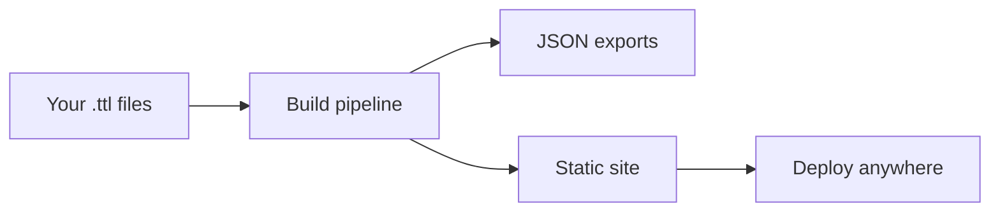

# Getting Started

Get a vocabulary site up and running in under 10 minutes.

## How It Works

Prez Lite takes your SKOS vocabulary files (Turtle format), processes them into optimised JSON, and generates a static website you can deploy anywhere.



No servers, no databases, no SPARQL endpoints required.

## Quick Start

### 1. Use the Template

The fastest way to start is from the GitHub template:

```bash
# Clone the template repository
gh repo create my-vocabs --template Kurrawong/prez-lite-template --public
cd my-vocabs
```

### 2. Add Your Vocabulary

Place your SKOS vocabulary as a `.ttl` file in the `data/vocabs/` directory:

```
data/
├── vocabs/
│   └── my-vocabulary.ttl    ← your file here
├── background/
│   └── agents.ttl           ← labels for external IRIs
└── config/
    └── profiles.ttl         ← rendering configuration
```

### 3. Build and Preview

```bash
pnpm install
pnpm build:data       # Process TTL → JSON
pnpm dev              # Start dev server
```

Open [http://localhost:3000](http://localhost:3000) to see your vocabulary.

### 4. Deploy

Push to GitHub and the included GitHub Action will build and deploy to GitHub Pages automatically.

```bash
git add .
git commit -m "feat: add my vocabulary"
git push
```

## Project Structure

```
my-vocabs/
├── data/
│   ├── vocabs/              # Your vocabulary .ttl files
│   ├── background/          # Labels for external IRIs
│   ├── config/
│   │   └── profiles.ttl     # Rendering configuration
│   └── validators/          # SHACL validation shapes
├── web/
│   ├── content/             # Content pages (markdown)
│   └── public/export/       # Generated exports (auto)
├── .github/workflows/       # CI/CD pipelines
└── package.json
```

## What Gets Generated

For each vocabulary, the pipeline produces:

| Output | Purpose |
|--------|---------|
| Annotated Turtle | Human-readable TTL with labels |
| JSON-LD | Linked Data applications |
| Concepts JSON | Tree browser, search index |
| Collections JSON | Collection groupings |
| RDF/XML | Legacy tool compatibility |
| CSV | Spreadsheet import |
| HTML | Standalone embeddable page |

## Next Steps

- [Write a vocabulary](/authoring/vocabularies) — SKOS structure, properties, and examples
- [Configure profiles](/authoring/profiles) — Control what properties are shown and how
- [Browse examples](/vocabs) — See published vocabularies
