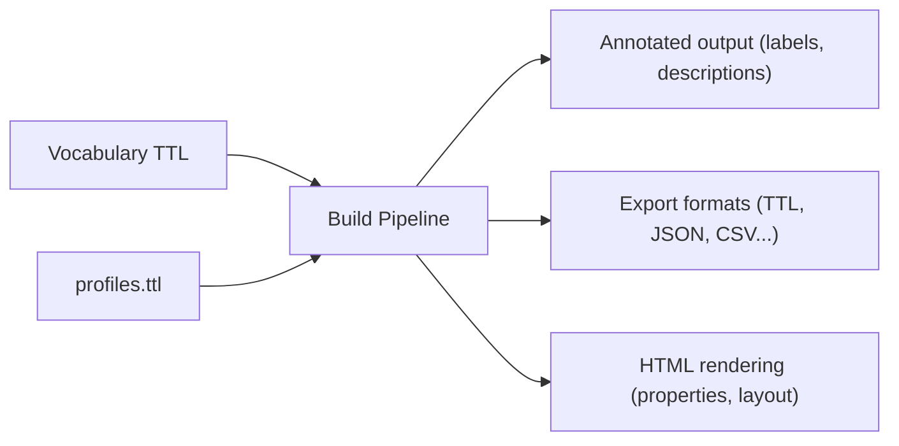
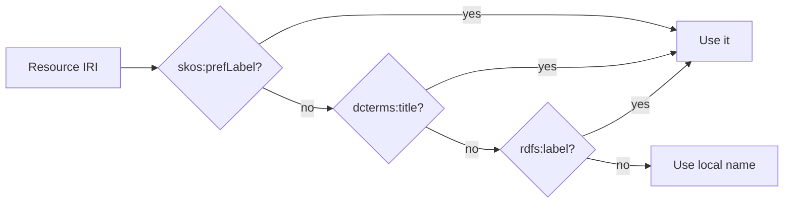

# Profiles

Profiles control how Prez Lite processes, renders, and exports your vocabularies. They're defined using SHACL shapes in `data/config/profiles.ttl`.

## What Profiles Do



A profile tells the pipeline:
- **What to label** — which predicates to use for display labels
- **What to describe** — which predicates provide descriptions
- **What to generate** — identifiers, labels, provenance annotations
- **What formats** — which export formats to produce

## Object Profiles

Each profile targets a specific RDF class. You'll typically have profiles for:

| Target Class | Controls |
|---|---|
| `skos:ConceptScheme` | How vocabularies are displayed |
| `skos:Concept` | How individual concepts are rendered |
| `skos:Collection` | How collections are presented |

### Example Profile

```turtle
PREFIX prez: <https://prez.dev/>
PREFIX sh: <http://www.w3.org/ns/shacl#>
PREFIX skos: <http://www.w3.org/2004/02/skos/core#>
PREFIX dcterms: <http://purl.org/dc/terms/>
PREFIX rdfs: <http://www.w3.org/2000/01/rdf-schema#>
PREFIX schema: <https://schema.org/>

prez:ConceptSchemeProfile a prez:ObjectProfile ;
    sh:targetClass skos:ConceptScheme ;

    # Where to find labels (tried in order)
    prez:labelSource skos:prefLabel, dcterms:title, rdfs:label ;

    # Where to find descriptions
    prez:descriptionSource skos:definition, dcterms:description ;

    # What annotations to generate
    prez:generateIdentifier true ;
    prez:generateLabel true ;
    prez:generateDescription true ;
.
```

## Label Resolution

The `prez:labelSource` property lists predicates in priority order. The pipeline tries each one and uses the first match:



## Catalog Configuration

The profile file also defines your vocabulary catalog:

```turtle
<https://example.org/catalogue/my-vocabs> a prez:Catalog ;
    dcterms:identifier "catalogue:my-vocabs"^^xsd:token ;
    dcterms:title "My Vocabularies" ;
    dcterms:description "A collection of domain vocabularies." ;
.
```

## Output Formats

Control which formats are generated per profile:

```turtle
prez:ConceptSchemeProfile
    altr-ext:hasResourceFormat
        <https://w3id.org/mediatype/text/turtle> ,
        <https://w3id.org/mediatype/application/ld+json> ,
        <https://w3id.org/mediatype/application/json> ,
        <https://w3id.org/mediatype/text/csv> ;
.
```

If no formats are specified, all are generated by default.

## Profile Helper Tool

Use the interactive [Profile Helper](/profile-helper) to build and validate profiles visually. It provides:

- Form-based profile builder
- Live TTL editor with syntax highlighting
- Real-time validation feedback
- Copy-ready output

## Next Steps

- [Profile Helper tool](/profile-helper) — Build profiles visually
- [Write vocabularies](/authoring/vocabularies) — SKOS structure and properties
- [Getting started](/authoring/getting-started) — Project setup
