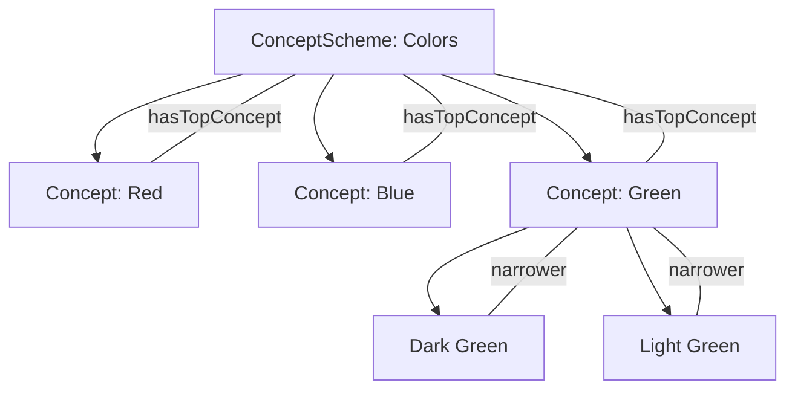

# Writing Vocabularies

Each vocabulary is a single Turtle (`.ttl`) file containing a `skos:ConceptScheme` and its `skos:Concept` members.

## Minimal Example

```turtle
PREFIX : <https://example.org/def/colors/>
PREFIX cs: <https://example.org/def/colors>
PREFIX skos: <http://www.w3.org/2004/02/skos/core#>
PREFIX schema: <https://schema.org/>
PREFIX xsd: <http://www.w3.org/2001/XMLSchema#>

cs:
    a skos:ConceptScheme ;
    skos:prefLabel "Colors"@en ;
    skos:definition "A vocabulary of color terms."@en ;
    skos:hasTopConcept :red, :blue, :green ;
    schema:creator <https://example.org/org/my-org> ;
    schema:dateCreated "2024-01-15"^^xsd:date ;
    schema:publisher <https://example.org/org/my-org> ;
.

:red
    a skos:Concept ;
    skos:prefLabel "Red"@en ;
    skos:definition "The color of blood or a ripe tomato."@en ;
    skos:inScheme cs: ;
    skos:topConceptOf cs: ;
.
```

## Vocabulary Structure



## Required Properties

### ConceptScheme

| Property | Description | Example |
|----------|-------------|---------|
| `skos:prefLabel` | Human-readable name | `"Colors"@en` |
| `skos:definition` | Description | `"A vocabulary of color terms."@en` |
| `skos:hasTopConcept` | Top-level concepts | `:red, :blue` |
| `schema:creator` | Who created it | `<https://example.org/org>` |
| `schema:publisher` | Who publishes it | `<https://example.org/org>` |

### Concept

| Property | Description | Example |
|----------|-------------|---------|
| `skos:prefLabel` | Human-readable name | `"Red"@en` |
| `skos:definition` | Meaning of the concept | `"The color of..."@en` |
| `skos:inScheme` | Parent scheme | `cs:` |

## Building Hierarchies

Use `skos:broader` to create parent-child relationships:

```turtle
:primary-colors
    a skos:Concept ;
    skos:prefLabel "Primary Colors"@en ;
    skos:inScheme cs: ;
    skos:topConceptOf cs: ;
.

:red
    a skos:Concept ;
    skos:prefLabel "Red"@en ;
    skos:inScheme cs: ;
    skos:broader :primary-colors ;
.
```

## Recommended Metadata

For richer display and better interoperability, add these to your scheme:

```turtle
cs:
    a skos:ConceptScheme ;

    # Required
    skos:prefLabel "Vocabulary Name"@en ;
    skos:definition "What this vocabulary describes."@en ;
    skos:hasTopConcept :concept1 ;
    schema:creator <https://example.org/org/creator> ;
    schema:publisher <https://example.org/org/publisher> ;
    schema:dateCreated "2024-01-15"^^xsd:date ;

    # Recommended
    schema:dateModified "2024-06-01"^^xsd:date ;
    schema:version "1.0" ;
    skos:historyNote "Created to standardize terminology..."@en ;

    # Optional
    schema:keywords <https://example.org/themes/geology> ;
.
```

## Background Labels

When your vocabulary references external IRIs (organizations, people), Prez Lite needs labels to display them. Add these to `data/background/`:

```turtle
# data/background/agents.ttl
PREFIX rdfs: <http://www.w3.org/2000/01/rdf-schema#>
PREFIX schema: <https://schema.org/>

<https://example.org/org/my-org>
    a schema:Organization ;
    schema:name "My Organization" ;
.
```

## Validation

Before publishing, check your vocabulary:

- All `skos:inScheme` references match the ConceptScheme IRI
- `skos:broader` relationships form a tree (no cycles)
- Every concept has a `skos:prefLabel`
- External IRIs have labels in background files

Prez Lite runs SHACL validation automatically and shows results on the scheme page.

## Next Steps

- [Configure profiles](/authoring/profiles) — Control rendering
- [Getting started](/authoring/getting-started) — Project setup and deployment
- [Browse examples](/vocabs) — See published vocabularies
