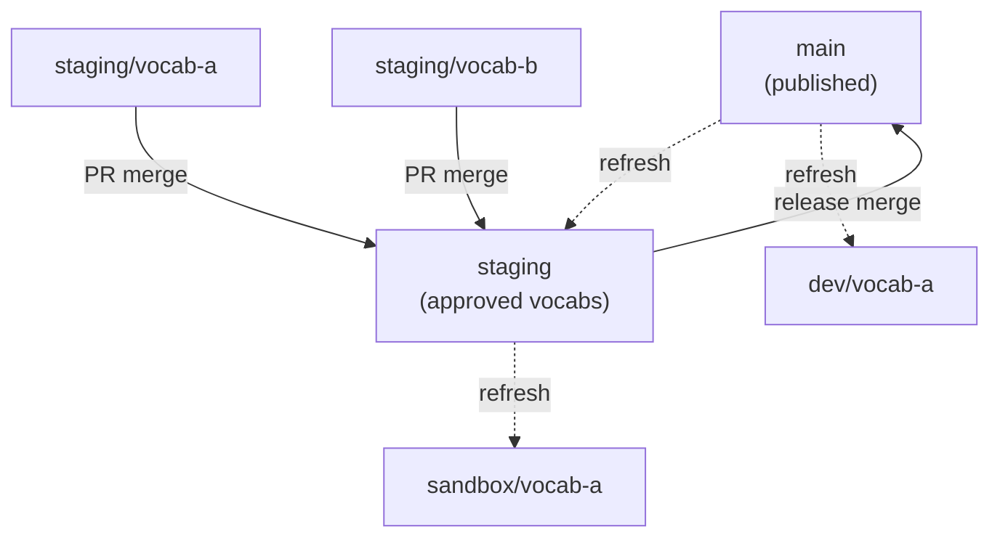
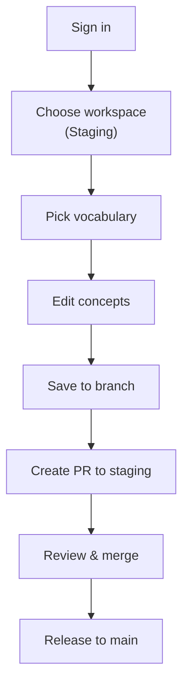
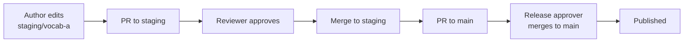

# Editing Workflow

Prez Lite uses **workspaces** to give vocabulary authors a structured editing pipeline. Each workspace creates per-vocabulary branches in Git, keeping changes isolated until they are reviewed and promoted.

## Workspaces

When you sign in and choose a workspace, Prez Lite creates a branch for each vocabulary you edit. Three workspaces are available:

| Workspace | Purpose | Who uses it |
|-----------|---------|-------------|
| **Staging** | Author and review vocabulary changes before publishing | Vocabulary authors |
| **Development** | Test system changes, integrations, or profile updates | Developers |
| **Sandbox** | Experiment freely — can be refreshed anytime | Anyone |

## Branch Model

Each workspace maps to per-vocabulary branches:

When you select a vocabulary in a workspace, Prez Lite creates a branch like `staging/colours` automatically. You edit on that branch, and promotion happens via pull requests.

## Typical Author Workflow

Step by step:

1. **Sign in** with GitHub using the header button
2. **Choose Staging** on the workspace page
3. **Select a vocabulary** — Prez Lite creates `staging/<vocab-slug>` if it doesn't exist
4. **Edit concepts** using the inline or full editor
5. **Save** — commits changes to the per-vocabulary branch
6. **Create a pull request** on GitHub to merge into `staging`
7. **Approver reviews and merges** the PR
8. **Release** — a second PR merges `staging` into `main` to publish

## Workspace Purposes

### Staging

The primary workspace for vocabulary authors. Changes are made per-vocabulary and merged into the `staging` branch through pull requests. Once a set of vocabulary updates is approved, `staging` is merged into `main` as a release.

- Branched from: `main`
- Merge target: `staging` (then `staging` to `main`)
- Use for: adding concepts, updating labels, fixing definitions

### Development

For developers making system-level changes — profile configuration, build pipeline updates, or integrations that need testing alongside vocabulary data.

- Branched from: `main`
- Merge target: `main` (via PR)
- Use for: profile changes, integration testing, pipeline adjustments

### Sandbox

A disposable workspace for experimentation. It is branched from `staging` so it has the latest approved content. You can refresh it at any time without losing important work.

- Branched from: `staging`
- Merge target: none (disposable)
- Use for: trying out changes, training, demonstrations

## Approval Process

Prez Lite relies on GitHub pull requests for approval:

- **Vocabulary authors** can push to their per-vocab branches freely
- **Reviewers** approve PRs into the workspace root branch (`staging`)
- **Release approvers** merge the workspace branch into `main` when ready to publish
- Branch protection rules on GitHub enforce the review requirements
