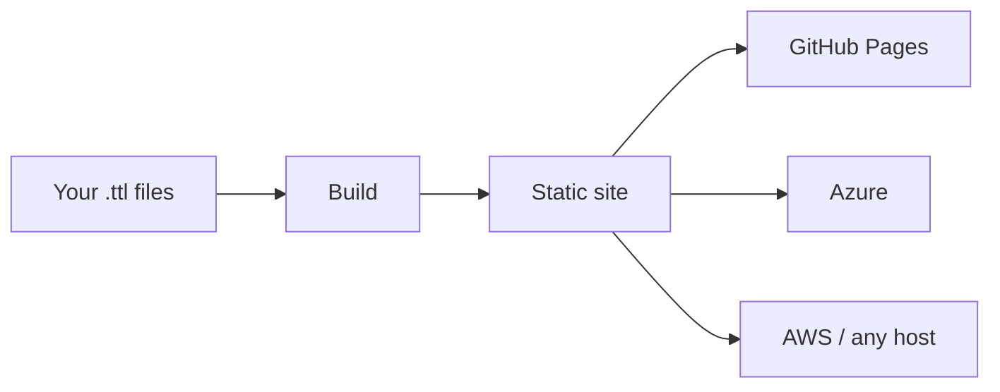
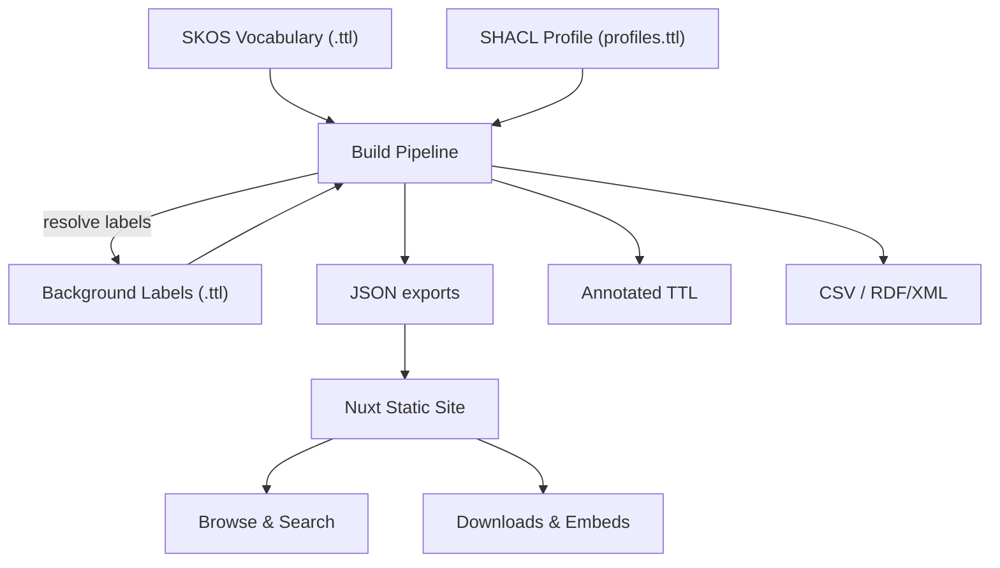

# Publish vocabularies, not infrastructure

Prez Lite turns your SKOS vocabulary files into a fast, searchable website you can deploy anywhere — no servers, no databases, no SPARQL endpoint required.



---

## What you get

**For vocabulary authors**
- Write vocabularies in standard SKOS Turtle format
- Hierarchical concept browser with full-text search
- Automatic exports in TTL, JSON-LD, CSV, RDF/XML
- SHACL validation out of the box

**For developers**
- Embeddable web components (`<prez-list>`) for any application
- JSON API for programmatic access
- Profile-driven configuration — no code changes needed
- GitHub Actions CI/CD included

**For organisations**
- Deploy to GitHub Pages, Azure, AWS, or any static host
- No runtime dependencies — just HTML, CSS, and JSON
- Standards-compliant: SKOS, DCAT, VocPub, Dublin Core

---

## Get started in minutes

```bash
# 1. Create from template
gh repo create my-vocabs --template Kurrawong/prez-lite-template --public
cd my-vocabs

# 2. Add your vocabulary
cp my-vocabulary.ttl data/vocabs/

# 3. Build and preview
pnpm install && pnpm build:data && pnpm dev
```

Push to GitHub and your site deploys automatically.

[Start authoring](/authoring/getting-started) or [browse example vocabularies](/vocabs).

---

## How it works



1. **Author** — Write SKOS vocabularies in Turtle format
2. **Configure** — Set up profiles to control labels, descriptions, and exports
3. **Build** — The pipeline processes TTL into optimised JSON
4. **Deploy** — Push to GitHub and your site goes live

---

## Built on standards

| Standard | Role |
|----------|------|
| [SKOS](https://www.w3.org/2004/02/skos/) | Vocabulary structure |
| [VocPub](https://w3id.org/profile/vocpub) | Publication profile |
| [SHACL](https://www.w3.org/TR/shacl/) | Validation and configuration |
| [DCAT](https://www.w3.org/TR/vocab-dcat/) | Dataset cataloguing |
| [Schema.org](https://schema.org/) | Metadata |
