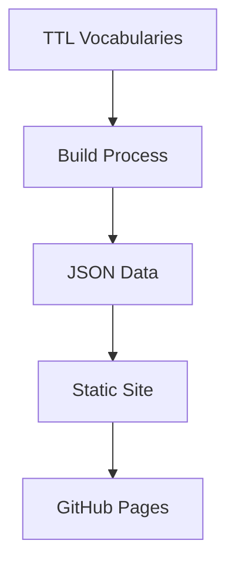

# Welcome to Prez Lite

Prez Lite is a lightweight, static vocabulary publishing platform that converts SKOS vocabularies into browsable web pages.

## Features

- **Static Generation** - Deploy anywhere without a backend server
- **SKOS Support** - Full support for SKOS concept schemes and vocabularies
- **VocPub Profile** - Compliant with the VocPub vocabulary publication profile
- **Search** - Full-text search across all vocabularies and concepts
- **Responsive** - Mobile-friendly design with modern UI components

## Getting Started

Browse the available [vocabularies](/vocabs) to explore the published concept schemes.

## About This Platform

This platform is powered by:

- [Nuxt](https://nuxt.com) - The Vue framework for web applications
- [Nuxt UI](https://ui.nuxt.com) - Beautiful UI components
- [SKOS](https://www.w3.org/2004/02/skos/) - Simple Knowledge Organization System

